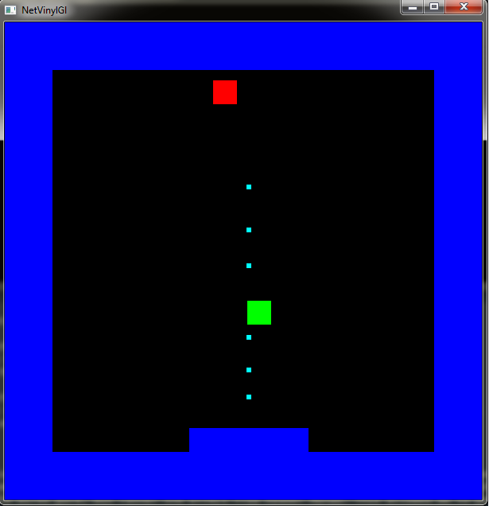

% Haskell Reactive Game Programming with Netwire, Vinyl and OpenGL
% Handré Stolp
% 14 October 2013

Introduction
========================================

Why
-------------------------------
* Why Haskell? 
    * Functional programming because its different than my OOP, imperitive, C++ background.
    * Picked Haskell by accident
    * Stuck with it because its scary and i like its air of "computer science formalism".
    * If I ever halfway mastser it I will become a ninja with safety goggles.
* Why game programming?
    * Fun way to explore a new domain.
    * Similar to my days job. 
    * For good or bad I know what kinds of concepts I would like to map to the functional space.
* Why OpenGL? 
    * Haskell has support for it.
    * Aligned with Haskell community's tenet of portability
* Why Vinyl and Vinyl-GL?
    * Modern OpenGL == No Fixed Function Pipeline
    * Marshalling data to OpenGL is a pain
    * Vinyl-GL makes it painless and safe.

Why
--------------------------------
* Why GLFW-b? 
    * It just installs, which for FFI libraries isn't always the case.
    * Makes it easy to get a window with graphics up and running.s
* Why FRP and why Netwire and why arrows? 
    * FRP is cool, at least it used to be, seems to be gaining coolnes again.
    * Introduced to arrows through early Netwire tutorial.
    * Sold by example of automaton arrow and local state.

The theory of crumbs
=========================

A little FRP
-------------------------
* Comes out of the Haskell community
* From late 1990s
* Pioneered by Conal Elliot and Paul Hudak
* Recent paper by Conal Elliot on Push-Pull FRP giving formal semantics and addressing implementation issues.
* Aims to simplify creating reactive systems (UIs, games etc)
* You say *what* something is not *how* to do something.
* You define relationships and the system ensures results upddte due to changes.
* Primitives 
    * Behaviours - continuous functions over time
    * Events - discrete functions over time / streams of time value pairs
    * Switch - switch behaviours due to event occurences

```haskell
Behaviour a :: T -> a
Event a :: [(T,a)]
Switch a :: Behaviour a -> Event (Behaviour a) -> Behaviour a
```

A smidgen of Arrows
-----------------------
* Abstract view computation defined by John Hughes. 
* Similar to Monads but more general. 
* Category of morphisms ??? (but I really don't know what I am talking about here) 
* But the important thing is functions are arrows 
* and other arrows are like functions with super secret jet packs. 
* An arrow is usually represented as **a b c** meaning 
    * arrow **a** 
    * takes a value **b** 
    * produces a value **c** 
    * all happening in the context defined by the arrow **a**

A smidgen of Arrows
-----------------------

```haskell
-- b -> c == (->) b c == a b c where a == (->)
--            ______                     ______ 
--           |     |                     |     |
--  input -> |  f  | -> output  ==  b -> |  a  | -> c
--           |_____|                     |_____|
--
-- (a b c . a d b) == (a b c <<< a d b) == (a d b >>> a b c) == a d c
--
--     ___________________________
--     |  ______   adc    ______ |
--     |  |     |         |     ||
-- d ->|  | adb | -> b -> | abc ||-> c
--     |  |_____|         |_____||
--     |_________________________|
--    
```

A smidgen of Arrows
-----------------------
* Just like functions arrows can be composed and evaluated
* Arrow combinators can be used to connect together networks of arrows
* Haskell also provides you with arrow notation which is similar to do notation to ease network creation.
* You evaluate the arrow **(->) b c** by providing the argument **b**
* Other arrows will have special *run* functions. 
* Example automaton arrow
    * Evaluation produces value and new evolved arrow
    * Evolved arrow used for next evaluation.
    * Local state can captured in the arrow itself.

```haskell
newtype Auto b c = Auto (b -> (c, Auto b c))
runAuto (Auto a) b = let (c, newAuto) = a b in (c, newAuto)
```

A dash of Netwire
-----------------
* Netwire is an arrow library that can be used for FRP and other forms of locally stateful programming. 
* The version I used was version 4
* Version 5 still in development. 
* Core primitive is an automaton arrow that evolves with time (thats how I see it)
* Its called a Wire and I think is more expressive than standard arrow semantics.
* A wire can either produce or inhibit
* If producing result of evaluation follows arrow semantics
* If inhibiting no output instead evaluation results in inhibition monoid.
* Inhibition of wire node inhibits entire sub-network.
* There are primitives to switch networks based on inhibition
* This allows you to merge sets of wires selecting the result based on wire inhibition.

A dash of Netwire
-----------------
* The wire type is **Wire e m a b** with.
* **Wire e m** defining the type of arrow. 
* **e** being the type of the inhibition monoid.
* **m** being the type of the Monad the wire inhabits. 
* You would usually fix **e** and **m** to specific types.

```haskell
data Wire e m a b 
type Event e m a = Wire e m a a
```

A dash of Netwire
-----------------
* Behaviours wires from **a** to **b** (Straight forward).
* Events wires from **a** to **a** (Involves subtleties). 
    * Modulate continuous signal flowing through it by either inhibiting or producing.
    * Netwire 4 events don't produce values
    * To get FRP event stream modulate value producing wire with event wire or use non event wire that inhibits.
    * Most cases FRP event stream is not what you want.
* Netwire 4 events are intervals in Netwire 5.
* Netwire 5 introduces explicit event type.

And garnish with Vinyl
----------------------
* What like in a record you play? Well yes. 
* Provides you constructs that you can use in place of Haskell Records.
* It allows you to construct custom product types as type lists.
* Uses all kinds of extensions for type level programming. 
* **Field** defined a distinct type as the combination of type level string and another type.
* **Rec**/**PlainRec** defines as type level list of fields giving you a record.

```haskell
Field :: "name" ::: String --- a distinct field type with symbol name "name"
type LifeForm = ["name" ::: String, "age" ::: Int, "sleeping" ::: Bool] -- an example of a record using vinyl
```

And garnish with Vinyl
----------------------
* Vinyl-GL uses the strings literals associated with fields to match values in your shaders. 
* It allows it to define your vertex layout automatically and check it at runtime.
* It allows you to automatically verify that all shader values are supplied and correct. 


The experiment
=========================

The game or not the game
-------------------------
* That is the question.
* The answer is that I spent too much time playing with scaffolding rather than defining a cool game.
* The basic "game" 
    * blue bordered area with 
    * a red and a green box bouncing around in it 
    * and a blue paddle at the bottom which
    * you can move around 
    * and that can shoot little bullets. 
    * Everything renders to screen collides with one another and the paddle responds to keyboard input. 
    * It is very basic but at least something to experiment with.

The game or not the game
-------------------------


The structure of things
-------------------------
* I wanted to keep the game loop pure 
    * Not just because the application is in Haskell
    * To parallelize it in the future.
* This had an impact on the Monad chosen for the wires. 
    * Did not go for Identity Monad
    * Went for the effect free Reader Monad. 
    * This allowed me to pass the environment to my wires without introducing dependency on effects.
* The environment holds all the resources and results from the GLFW callbacks. 
* How do I draw stuff then? 
    * The main wire produces a stream of lists of IO actions.

```haskell
type WireM' = WireM ReadAppM        -- The type of wires in the app
type EventM' a = EventM ReadAppM a  -- The type of events in the app
mainW :: WireM' a [IO()]            -- The main wire takes nothing but produces IO actions
```

The structure of things
-------------------------
* I wanted to make it easy to register callbacks and load other resources 
* I wanted to be flexible with which resource are available. 
* I decided to use vinyl records to represent all the data in my Reader Monad and use type classes to iterate over them and initialize them.
* The flow of the application is then as follows:
    1. Construct the environment loading resources and registering callbacks etc.
    2. Step the main wire running it inside the reader monad.
    3. Perform all the actions returned by the main wire (draw stuff).
    4. Update the environment due to GLFW callbacks.
    5. Repeat from step 2 until the main wire inhibits.

The structure of things
-------------------------
Excerpt from code showing environment type **App** and the type class used to iterate over one
of the top level types.

```haskell
-- Our application record consisting of a set of call back data, a function to update
-- the call back data, a set IO actions that may be used to draw things to screen and 
-- the initial width and height of the screen.
type App = PlainRec [Callbacks, CallbacksUpdater, Renderables, InitWidthHeight]

-- The Renderables field contains all the available renderables (things that can be drawn)
-- the elements of the record are instantiated through CreateRenderable class
type Renderables = "Renderables" ::: PlainRec '[DrawUnitBox]
renderables :: Renderables
renderables = Field

-- Class defines function used to create a renderable in Renderables
class CreateRenderable a where createRenderable :: Shaders -> IO (PlainRec '[a])

-- Class used to iterate over the renderables in Renderables
class CreateRenderables a where createRenderables :: Shaders -> IO a

-- CreateRenderables for empty rec is empty
instance CreateRenderables (PlainRec '[]) where createRenderables _ = return $ RNil

-- CreateRenderables for rec is CreateRenderable for the head prefixed to CrreateRenderables for the tail
instance (CreateRenderable f, CreateRenderables (PlainRec rs)) => CreateRenderables (PlainRec (f ': rs)) where
        createRenderables ss = (V.<+>) <$> createRenderable ss <*> createRenderables ss
`````


Handling callbacks
--------------------------
* Dealing with callbacks is painful in Haskell even when having to hook into a nice minimalist library like GLFW-b. 
* I wanted to make it easy to register callbacks with GLFW and to store the results in my Reader Monad
* Wanted to generate wire events based on callback data in my Reader Monad.
* A blog I read introduced the idea of queueing up the callback results using STM and processing them later. 
* I added a helper to do this for me.
    * You give it the callback registering function
    * and a lens to where the tupled up arguments to the callback should be stored
    * and it returns a function that will update the environment with the callback data.
* So you define a Vinyl type for your callback 
* Add an instance for **RegisterCallback** where you use the helper to register the callback.
* Access the callback data using the **readW** wire and build events based on the callbacks.

Handling callbacks
--------------------------

```haskell
-- Set a GLFW call back using a lens to store the accumulated values in some type
setCallBackGLFW :: forall c s m. (MonadIO m, CurryGLFW c)   
                => (Maybe c -> IO())                        -- The specific call back registration function
                -> Lens' s [TplGLFW c]                      -- The lens allowing us to store the result
                -> m (s -> m s)                             -- The resultant updater function transfering callback results
setCallBackGLFW f l = do
    -- Create the uncurried call back and the update function which are glued together
    (cb, upd) <- glueCbGLFW l
    -- set the call back
    liftIO $ f (Just (curryGLFW cb))
    return upd

-- Take a lens form some type to a list of tuples and return two functions
-- the one function adds values to the list as an IO action
-- the other function empties the list and modifies the type using the lens 
glueCbGLFW :: MonadIO m => Lens' s [t] -> m (t -> IO (), s -> m s)
glueCbGLFW l = do
        -- an STM TVar used communicate between the two functions
        var <- liftIO $ newTVarIO ([] :: [t])
        let -- The call back appends new tuple values to the list
            cb t = atomically . flip modifyTVar' (t:) $ var
            -- The updater set the value referenced by the lens and clears the list in the TVar
            upd s = (liftIO $ atomically . flip swapTVar [] $ var) >>= (\ts -> return $ set l ts s)
        return (cb, upd)

-- Example of call back registration
-- The type which stores the results of the window size call back for this instant
type CbWindowSize = "WindowSizeCallback" ::: [(GLFW.Window, Int, Int)]
cbWindowSize :: CbWindowSize
cbWindowSize = Field 
instance RegisterCallback CbWindowSize where 
        registerCallback _ win = setCallBackGLFW (GLFW.setWindowSizeCallback win) (rLens callbacks . rLens cbWindowSize)

-- Given a lens produce a wire which provides the environment value at the current instant
readW :: (Lens' App b) -> WireM' a b
```

Handling resources
--------------------------------
* Only resources were shaders and vertex buffers 
* Combined into a single resource as a renderable (function taking shader values and rendering to screen)
* In a serious system you would actually want to batch your dispatching to OpenGL based on the shaders and vertex data.
* Probably overcomplicated way of loading the shaders and making the renderables. 
* Available shaders represented by a vinyl type list 
    * Type class used to iterate over them 
    * Load a shader per "shader type", 
    * Only had one shader. 
* Renderables represented by vinyl type list.
    * Type class used to iterate over them and construct them
    * Construction function passed list of shaders
    * Allows me to combine the set of shaders with the set of vertex buffers to get the set of renderables.
    * Only had one vertex buffer (a square)

Handling resources
--------------------------------
* The vertex data is represented as a list of vinyl records of storable types 
* The name tags of the fields are the same as the names of the vertex inputs in the shader.
* Vinyl-GL takes care of working out how to upload the data to OpenGL 
* Will give you an error if anything does no match up. 
* The same is true for the shader values that will be uploaded to the shader, 
* Shader values are represented as a vinyl record.


Handling resources
--------------------------------

```haskell
-- Take a shader and some geometry and return an action which takes a record of shader values and renders it
makeRenderable :: (ViableVertex (PlainRec ves), UniformFields (PlainRec svs))
               => GLU.ShaderProgram                 -- The shader program
               -> ([PlainRec ves], [GLU.Word32])    -- The geometry consisting of vertexes and indexes
               -> IO (PlainRec svs -> IO())         -- The function taking shader values and rendering 

-- loading a shader
type Simple2D = "Simple2D" ::: GLU.ShaderProgram
simple2D :: Simple2D
simple2D = Field
instance LoadShader Simple2D where 
    loadShader = (simple2D =:) 
              <$> GLU.simpleShaderProgramWith  ("Simple2D.vert") ("Simple2D.frag") (\_-> printGlErrors)

-- Shader value for
type MWorldViewProj2D = "mWorldViewProj2D" ::: M44 CFloat -- Associated with mWorldViewProj2D uniform shader value
mWorldViewProj2D :: MWorldViewProj2D
mWorldViewProj2D = Field

-- create the renderable using the shader and a utility function to make a box geometry
type DrawUnitBox = "DrawUnitBox" ::: (PlainRec [MWorldViewProj2D, VColour] -> IO ())
drawUnitBox :: DrawUnitBox
drawUnitBox = Field
instance CreateRenderable DrawUnitBox where
        createRenderable ss = (drawUnitBox =:) <$> (makeRenderable (ss ^. rLens simple2D) $ makeBox (V2 1 1))

-- vertex data
type VPosition2D = "vPosition2D" ::: V2 CFloat      -- Associated with vPosition2D vertex element in the shader
vPosition2D :: VPosition2D
vPosition2D = Field
-- function creates vertex data for a box 
makeBox  :: V2 CFloat                                    -- The extents 
         -> ([PlainRec '[VPosition2D]], [GLU.Word32]) -- The geometry's vertexes and indexes


-- Take a shader and some geometry and return an action which takes a record of shader values and renders it
makeRenderable :: (ViableVertex (PlainRec ves), UniformFields (PlainRec svs))
               => GLU.ShaderProgram                 -- The shader program
               -> ([PlainRec ves], [GLU.Word32])    -- The geometry consisting of vertexes and indexes
               -> IO (PlainRec svs -> IO())         -- The function taking shader values and rendering 
```


Dealing with a dynamic set of wires
------------------------------------
* Netwire allows you to switch wires due to events 
* This only allows you swap out a sub network 
* Subnetwork could be as complex as you like 
* Subnetwork can depend on the switching wire's input 
* I thought I needed more. 
    * Probably due to a lack of experience with Netwire.

Dealing with a dynamic set of wires
------------------------------------
* Top level wires represent objects in world.
* The input to each wire includes the previous results of all others 
    * (so they can react to each other).
* Top level sum type called **Thing** (can be one of many things)
* Top level wire called **ThingWire**
    * **WireM' [Thing] ( IO(), (Thing, [ThingWire])**
    * Take other things
    * Produce IO action, itself and possible list of new things.
* Wire to step all top level wires (**stepThingWires :: WireM' [ThingWire] [IO()]**)
    * Take set of thing wires and evolve them
    * Results of all other wires passed to each wire
    * Any wire that inhibits gets removed
    * Any new wires produced gets added to set of wires
    * If all wires inhibit then the wire inhibits.

Dealing with a dynamic set of wires
------------------------------------

```haskell
-- The top level sum type
data Thing = BouncingBox Box | Border Box | Paddle Box | Bullet Box deriving Show

-- Wrap the top level wires wich take the list of other thins and produces an action a thing and a list of possible new things.
newtype ThingWire = ThingWire {  unThingWire :: WireM' [Thing] ( IO(), (Thing, [ThingWire]) )  } 

stepThingWires :: WireM' [ThingWire] [IO()]
stepThingWires = mkStateM ([],[]) stepWs
    where
        stepWs :: Time
               -> (  [ThingWire], ( [(Thing, ThingWire)], [ThingWire] )  )
               -> ReadAppM (  Either LastException [IO()], ( [(Thing, ThingWire)], [ThingWire] )  )

        stepWs dt (ews, (tws, iws)) = do
                atwsO <- connect [] tws
                atwsNE <- map fromJust . filter isJust <$> sequence (map (stepW tws) ews)
                atwsNI <- map fromJust . filter isJust <$> sequence (map (stepW tws) iws)
                case atwsO ++ atwsNE ++ atwsNI of
                    -- nothing so inhibit
                    [] -> return (Left mempty, ([],[]))
                    -- something so return actions
                    rs -> return ( Right . map (^._1) $ rs
                    -- and state for next update
                                 , (map ((^._2) &&& (^._3) >>^ uncurry (,)) &&& concatMap (^._4) >>^ uncurry (,)) rs
                                 )
            where
                connect :: [(Thing, ThingWire)] -> [(Thing, ThingWire)] -> ReadAppM [(IO(), Thing, ThingWire, [ThingWire])]
                connect _ [] = return []
                connect ls (c@(_,w):rs) = do
                        s <- (stepW (ls ++ rs) w) 
                        r <- (connect (c:ls) rs)
                        case s of
                            Nothing -> return  r
                            Just a -> return (a : r)

                stepW :: [(Thing, ThingWire)] -> ThingWire -> ReadAppM (Maybe (IO(), Thing, ThingWire, [ThingWire]))
                stepW tws' w  = do 
                    let ts = map fst tws'
                    (r, w') <- stepWire (unThingWire w) dt ts
                    case r of
                        Left _ -> return $ Nothing
                        Right (a, (t, nws)) -> return $ Just (a, t, ThingWire w', nws)
```

Events
--------------------------
* Were wires which queried the environment and then either inhibited or acted as the identity wire
* This was not the first way I tried to approach it. 
* First I had the event take any value and then either inhibit or produce the value. 
* This does not compose because you cannot embed them in other networks. 
* The key is to realize that events in Netwire 4 are the same as intervals in Netwire 5 
    *   They should modulate the interval of production of the signals flowing through them.

```haskell
-- Create a wire event the produces only when the specified key has been pressed
keyDownE :: GLFW.Key -> EventM' a
keyDownE k =  passOver $ require pressed . readW (rLens callbacks . rLens cbKey)
    where
        pressed = not . null . filter (\t -> (t^._2 == k && t^._4 == GLFW.KeyState'Pressed))

-- take some wire turning it into an identiy wire but retaining the argument wires ihibition properties
passOver :: WireM' a b -> EventM' a
passOver w = fst <$> (id &&& w)
```

Events
--------------------------

* Another stumble block was generating an event which depends on a previous event.
* For that I used the **switch** construct.
* Example was the key held event/interval
* So when the key is pressed it produces an event wire which produces as long as the key is not up 
* Initially we start with an inhibiting wire.

```haskell
keyHeld :: GLFW.Key -> EventM' a
keyHeld k = switch (pure ( untilKeyUpE k) . keyDownE k) (inhibit $ mempty)
```

Events
--------------------------
* Sometimes you would want to switch your behaviour based on a choice of events 
* For this you use **<|>** since wires are Alternative Applicative Functors.

```haskell
vel =  (keyHeld GLFW.Key'Left) . pure (V2 (-1.5) 0.0)   -- if key left produce negative x velocity
    <|> (keyHeld GLFW.Key'Right) . pure (V2  1.5 0.0)   -- else if key right produce positive x velocity
    <|> pure (V2 0 0)                                   -- else produce zero velocity
```

Behaviours
-------------------------
* Behaviours are networks of wires modifying the signals flowing through them. 
* Create complex networks by composing simpler ones. 
* There are many ways you can compose the wires. 
    * The arrow composition operators, 
    * Function composition
    * The Applicative and Alternative operators 
    * Even using arithmetic operators. 
* There is also special arrow syntax which is especially handy when wanting to use local feedback or recursion.

Behaviours
-------------------------
* The **rec** key word is required when there is a recursive dependency between the wires. 
* In general will have to use a **delay** somewhere in your recursive chain. 
* Recursion can be used to capture local state (**v'**). 
    * Could use of **mkState** / **mkStateM** for custom wire with explicit state.
    * I was doing this in the beginning but feel implicitly capturing it is better. 
* In general I found it is better to keep your wires short and to the point. 

```haskell
integralV :: (Additive f, Fractional a)
          => f a                        -- The constant of integration (starting point)
          -> WireM' (f a) (f a)         -- Wire that produces the integral of its input signal
integralV c = proc v -> do
    rec
        v' <- delay zero . arr (uncurry  (^+^)) . first (arr (uncurry (^*)) . (id &&& realToFrac <$> dtime))  -< (v,v')
    returnA -< c ^+^ v'
```


Behaviours
-------------------------
Here is an example of my most complex wire.

```haskell
paddleW :: WireM' [Thing] (IO (), (Thing, [ThingWire]))
paddleW = proc ts -> do
        rec
            v   <- vel -< ()                                        -- we get our velocity from key held events
            cs  <- collisionsFiltered borderOnly -< (t,ts)          -- we collide only with border things
            -- we integrate our velocity to get position and reflect velocity when colliding
            p   <- integralV (V2 0 (-0.8)) . reflectVel -< (v, cs)  
            d   <- drawBoxW extent (V4 0 0 1 1) -< p                -- we draw a box at paddle position
            t   <- Paddle ^<< flip Box extent ^<< id  -< p          -- we let the rest of the things know where we are
            -- we generate new bullet wire by pressing spacebar using our position and our x-velocity
            bs  <- fireBullet -< (p,v)                              
        returnA -< (d, (t,bs))                                      -- (OurDrawAction, (UpdatedUs, NewBullets))
    where
        extent = V2 0.25 0.1

        vel :: WireM' a Velocity
        vel =  (keyHeld GLFW.Key'Left) . pure (V2 (-1.5) 0.0)
           <|> (keyHeld GLFW.Key'Right) . pure (V2  1.5 0.0)
           <|> pure (V2 0 0)

        fireBullet :: WireM' (Position, Velocity) [ThingWire]
        fireBullet =  (keyDownE GLFW.Key'Space) . arr ((:[]) . ThingWire . uncurry bulletW) . arr (_2._y .~ 1) . arr (_1._y .~ -0.75)
                  <|> pure []
        
        borderOnly (Border _) = True
        borderOnly _  = False
````

Stuff to read
==========================
here is a list of some resources (that I can remember) that helped me.
-------------------------
* [Postmodern Haskell and OpenGL: Introducing vinyl-gl](http://www.arcadianvisions.com/blog/?p=388)
* [Vinyl: Modern Records for Haskell](http://www.jonmsterling.com/posts/2013-04-06-vinyl-modern-records-for-haskell.html)
* [Haskell/Understanding arrows](http://en.wikibooks.org/wiki/Haskell/Understanding_arrows)
* [Haskell/Arrow tutorial](http://en.wikibooks.org/wiki/Haskell/Arrow_tutorial)
* [Learning Modern 3D Graphics Programming](http://www.arcsynthesis.org/gltut/)
* [OpenGL in Haskell: GLFW-b Boilerplate](http://www.tapdancinggoats.com/opengl-in-haskell-glfw-b-boilerplate.htm)
* [Modern OpenGL with Haskell](http://www.arcadianvisions.com/blog/?p=224)
* [Asteroids & Netwire](http://ocharles.org.uk/blog/posts/2013-08-18-asteroids-in-netwire.html)
* [Getting Started with Netwire and SDL](http://ocharles.org.uk/blog/posts/2013-08-01-getting-started-with-netwire-and-sdl.html)
* [Haskell OpenGL animation done right: using closures and channels instead of IORef’s](http://dmytrish.wordpress.com/2013/01/12/haskell-opengl-animation-done-right/)

